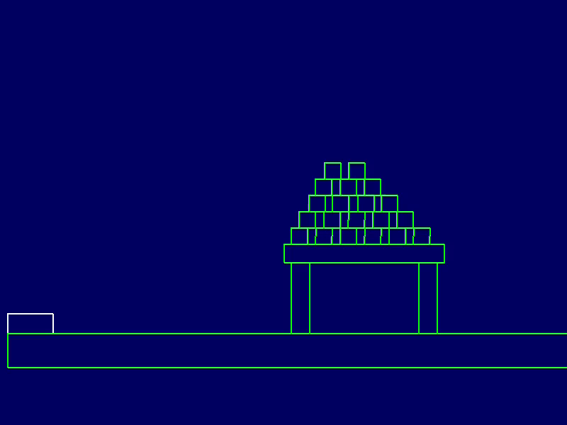

# Abstract

In recent decades, the development of video games has evolved at a surprising pace, leading to the creation of increasingly immersive and engaging gaming experiences, not only in 3D games but also in 2D games. However, 2D games require a solid technological foundation to provide a good gaming experience, and one of the most critical aspects is the management of collisions between various objects within the game.

Collision detection is a fundamental operation in 2D games as it allows determining whether two or more objects collide and calculating an appropriate response, such as reconstructing the trajectory of the objects or applying a reaction force. Since collision management can become very complex in the presence of irregular objects or objects with complex shapes, it is important to have efficient and accurate collision detection algorithms at your disposal.

## Project
This Project is a lightweight physics engine for 2D games. It provides an easy-to-use interface for simulating the real-world physics of objects in a 2D game environment.

### Features

- Support for common 2D physics simulations, including gravity, momentum, and collision detection
- Flexible and customizable physics parameters, such as mass, velocity, and restitution

## Example

