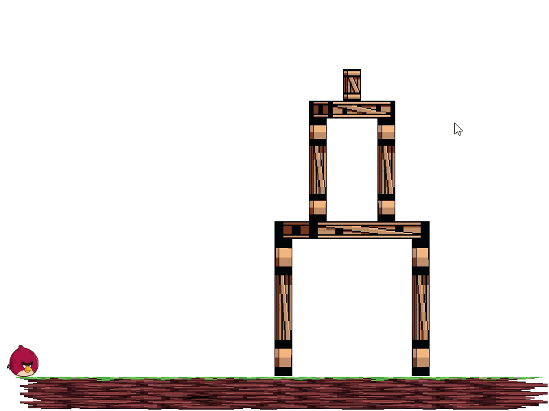

# 2Dynamics
2Dynamics is a lightweight physics engine for 2D games. It provides an easy-to-use interface for simulating the real-world physics of objects in a 2D game environment.

### Features
- Support for common 2D physics simulations, including gravity, momentum, and collision detection
- Flexible and customizable physics parameters, such as mass, velocity, and restitution

### Getting Started
To use 2Dynamics in your game project, first download the library and include the header file in your source code:
```c
#include "2dynamics.h"
```
Then, create a new 2Dynamics world object and add your game object to the world:
```c
// create a new 2Dynamics world with default parameters
World* world = createWorld();

// create a new game object with a rectangular shape and add it to the world
GameObject* object = createGameObject(RectangleShape, 100, 100);
addObjectToWorld(world, object);
```
Finally, update the world every frame to simulate the physics of your game objects:
```c
// update the world to simulate physics for one frame
updateWorld(world, deltaTime);
```
## Example

